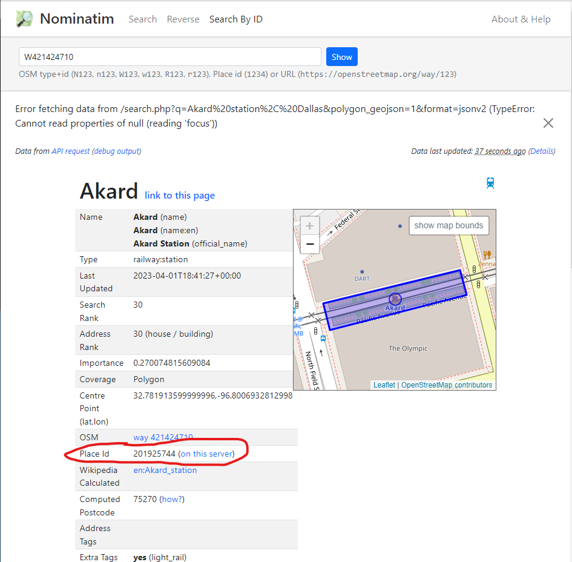

## DISCLAIMER:
By using the OpenStreetMaps Nominatim servers, you acknowledge that you will abide by OpenStreetMaps's usage policy: https://operations.osmfoundation.org/policies/nominatim/. If you are an organizational user, or need heavier uses of this plugin, we *highly* recommend that you set up your own Nominatim server: https://nominatim.org/release-docs/latest/admin/Installation/. Your organization's IT department should be able to do this. *Failure to abide by these rules may lead you to be banned from using this plugin!*

# Addresser

Addresser is a Microsoft Excel add-in allowing users to retreive information about addresses such as their city, county, zip code (TODO) and coordinates (TODO) through custom Microsoft Excel functions. It uses the OpenStreetMap Nominatim API. The add-in is currently optimized for addresses in the Dallas-Fort Worth area, and may not work at all for addresses outside the United States.

Addresser works on Excel for Windows, Excel for Mac, and Excel on the Web. Addresser does *not* work on Excel for iOS/iPadOS or Excel for Android.

## Features
- Allows you to retreive city, county from any text address, even one where such details are not explicitly given ("123 Walnut Hill")
- TODO: state (what did he mean by this?)
- Uses intelligent, long-term caching to save on API calls and speed up future searches on the same address, even if you restart your computer.
- TODO: Customizable search bounds. Allows you to narrow down your search to a specific region to improve speed and accuracy.
- TODO: intelligent auto-correct. Will find addresses even if they have typos.

## Installation
TODO

## Usage
After installing the add-in, the functions can be called in Excel through regular formulas. All Addresser functions start with the prefix `ADDRESSER`.

Add-in settings can be changed through the taskpane. Go to Add-ins -> Addresser -> Show Taskpane.

## Functions
`ADDRESSER.CITY(address_parts)` - finds the city where the given address is located. Returns `NOT FOUND` if fails.
- `address_parts` - see [address_parts](#address_parts)

`ADDRESSER.CITYFROMLIST(list, address_parts)` - finds the city where the given address is located. It first attempts to find it from the cell range given in the list. If it fails, it uses an API call. Returns `NOT FOUND` if fails.
- `list` - a range of cells (B4:C6)
- `address_parts` - see [address_parts](#address_parts)

`ADDRESSER.COUNTY(address_parts)` finds the county where the given address is located. Returns `NOT FOUND` if fails.
- `address_parts` - see [address_parts](#address_parts)

`ADDRESSER.COUNTYFROMLIST(list, address_parts)` finds the county where the given address is located. It first attempts to find it from the cell range given in the list. If it fails, it uses an API call. Returns `NOT FOUND` if fails.
- `list` - a range of cells (B4:C6)
- `address_parts` - see [address_parts](#address_parts)

`ADDRESSER.FALLBACK(inputs)` given a list of inputs, attempts to resolve the first input. If it succeeds, returns that input. If the first input results in an error or `NOT FOUND`, tries the second input. Continues until reaching the last input. **This works with all inputs, not just Addresser functions!**
- `inputs` - a series of comma-deliminated valid formulas (ADDRESSER.CITY("1234 Walnut Hill), SUM(A3:B5), A4, "Potato")

TODO: `ADDRESSER.ADDTOCACHE(original, place_id)` permanently add the original address to the cache with the given `place_id`. Every time the address is found, it will evaluate to the given place_id. This is useful when frequently encountering the same address that fails to evaluate.
- `address` - a given address ("1234 Walnut Lane")
- `place_id` - a Nominatim place id, given as a string ("201925744"). To find the place ID, go to https://nominatim.openstreetmap.org and find your place. Then, go to that location's details and look for the Place Id row: 

### address_parts
Any function with an `address_parts` input can be sent as:
- plain text ("1234 Walnut lane")
- a single cell (A3)
- a range of cells (A3:B4)
- a list of any of the above, deliminated by commas (A3, B4:B5, "Dallas Texas")

When sending multiple inputs, they will be sent to the function as a combined, comma-deliminated address (A3, B4:B5, "Dallas Texas" *will become* "1234, Walnut, Lane, Dallas Texas").

<!--future update, enable switching to Google Maps or ArcGIS instead....>